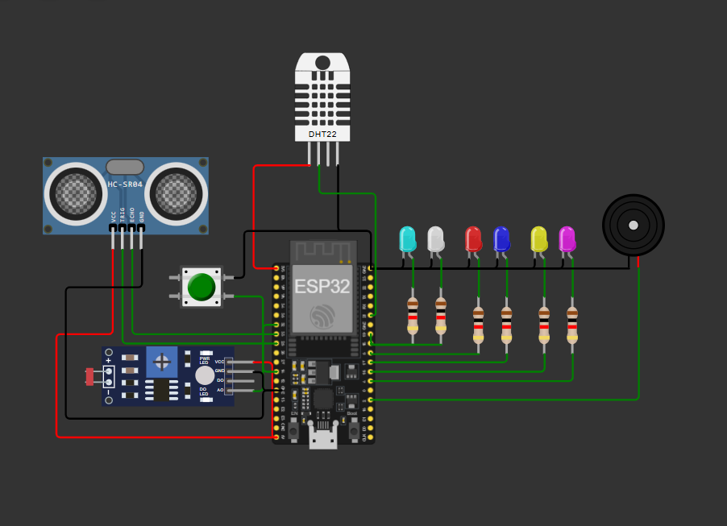

# Smart Greenhouse ESP32

Sistema de monitoreo y control automatizado para invernaderos desarrollado con ESP32 y MicroPython. El proyecto fue implementado y validado mediante simulación en Wokwi, integrando sensores ambientales, control automático de actuadores y un sistema de emergencia.

## Descripción

El sistema monitorea continuamente variables críticas para el crecimiento de las plantas:

- Temperatura
- Humedad relativa
- Intensidad lumínica
- Nivel de agua del tanque de riego

A partir de estas mediciones, el controlador ejecuta acciones automáticas para mantener condiciones adecuadas dentro del invernadero.

## Simulación

Proyecto desarrollado y probado en Wokwi:

https://wokwi.com/projects/460023497070921729



## Características

- Monitoreo de temperatura y humedad mediante DHT22.
- Medición del nivel de agua utilizando HC-SR04.
- Control automático de iluminación mediante LDR.
- Activación automática de ventilación, humidificación, extracción y nebulización.
- Sistema de emergencia mediante interrupciones.
- Alarma sonora mediante buzzer.
- Implementación en ESP32 utilizando MicroPython.

## Tecnologías Utilizadas

- ESP32 DevKit
- MicroPython
- Wokwi
- DHT22
- HC-SR04
- LDR (Fotoresistor)

## Componentes del Sistema

| Componente | Función |
|------------|----------|
| ESP32 | Unidad de procesamiento |
| DHT22 | Medición de temperatura y humedad |
| LDR | Medición de luminosidad |
| HC-SR04 | Medición del nivel del tanque |
| Buzzer | Alarma sonora |
| Pulsador | Activación del modo emergencia |
| LEDs | Simulación de actuadores |

## Arquitectura del Sistema

### Sensores

- DHT22 → Temperatura y humedad.
- LDR → Intensidad lumínica.
- HC-SR04 → Nivel de agua.

### Actuadores Simulados

- Ventilador.
- Humidificador.
- Nebulizador.
- Extractor.
- Sistema de iluminación.
- Sistema de llenado del tanque.
- Alarma sonora.

## Estrategia de Control

### Control de Temperatura

- Temperatura > 37 °C → Activación de ventilación.
- Temperatura < 20 °C → Activación de humidificación.

### Control de Humedad

- Humedad < 40 % → Activación de nebulización.
- Humedad > 80 % y temperatura > 37 °C → Activación de extractores.

### Control de Iluminación

- Intensidad lumínica < 100 lux → Encendido de iluminación artificial.
- Se implementa un ciclo de fotoperiodo simulado:
  - 2 segundos encendido.
  - 10 segundos apagado.

### Control del Nivel de Agua

- Distancia > 180 cm → Tanque bajo.
- Distancia entre 20 cm y 180 cm → Proceso de llenado.
- Distancia < 20 cm → Tanque lleno.

### Modo Emergencia

Mediante una interrupción asociada a un pulsador:

- Se desactivan todos los actuadores.
- Se activa una alarma sonora.
- El sistema permanece en estado seguro hasta su desactivación.

## Estructura del Proyecto

```text
Smart-Greenhouse-ESP32/
│
├── README.md
├── src/
│   └── main.py
│
├── wokwi/
│   └── diagram.json
│
└── images/
    ├── circuito.png
    └── simulacion.png
```

## Resultados

Las pruebas realizadas permitieron validar el comportamiento esperado del sistema:

- Activación automática de ventilación ante altas temperaturas.
- Activación de humidificación en condiciones de baja temperatura.
- Activación de nebulización cuando la humedad disminuye.
- Control automático del nivel del tanque.
- Gestión del fotoperiodo mediante iluminación artificial.
- Correcto funcionamiento del modo de emergencia mediante interrupciones.

## Posibles Mejoras

- Integración con MQTT.
- Monitoreo remoto mediante WiFi.
- Dashboard web para visualización de datos.
- Almacenamiento histórico de mediciones.
- Aplicación móvil para supervisión remota.
- Implementación de algoritmos predictivos para optimizar el consumo de agua.

## Autores

**Tamara Valeria Escobar Andrade, Santiago Rodríguez Bermeo y Thomas Trujillo Cerquera**

Proyecto académico desarrollado utilizando ESP32, MicroPython y Wokwi para la automatización de un sistema de invernadero inteligente.
